```mermaid
flowchart TB
    subgraph current["CoinFlipGame.Api.csproj"]
        MAIN["<b>📦&nbsp;CoinFlipGame.Api.csproj</b><br/><small>net8.0</small>"]
        click MAIN "#coinflipgameapicoinflipgameapicsproj"
    end
    subgraph downstream["Dependencies (2"]
        P6["<b>📦&nbsp;CoinFlipGame.Shared.csproj</b><br/><small>net8.0</small>"]
        P5["<b>📦&nbsp;CoinFlipGame.Lib.csproj</b><br/><small>net8.0</small>"]
        click P6 "#coinflipgamesharedcoinflipgamesharedcsproj"
        click P5 "#coinflipgamelibcoinflipgamelibcsproj"
    end
    MAIN --> P6
    MAIN --> P5

```

```mermaid
flowchart TB
    subgraph current["CoinFlipGame.App.csproj"]
        MAIN["<b>📦&nbsp;CoinFlipGame.App.csproj</b><br/><small>net8.0</small>"]
        click MAIN "#coinflipgameappcoinflipgameappcsproj"
    end
    subgraph downstream["Dependencies (1"]
        P6["<b>📦&nbsp;CoinFlipGame.Shared.csproj</b><br/><small>net8.0</small>"]
        click P6 "#coinflipgamesharedcoinflipgamesharedcsproj"
    end
    MAIN --> P6

```

```mermaid
flowchart TB
    subgraph current["CoinFlipGame.DB.sqlproj"]
        MAIN["<b>⚙️&nbsp;CoinFlipGame.DB.sqlproj</b><br/><small>.NETFramework,Version=v4.7.2</small>"]
        click MAIN "#coinflipgamedbcoinflipgamedbsqlproj"
    end

```

```mermaid
flowchart TB
    subgraph current["CoinFlipGame.ImageUploader.csproj"]
        MAIN["<b>📦&nbsp;CoinFlipGame.ImageUploader.csproj</b><br/><small>net8.0</small>"]
        click MAIN "#coinflipgameimageuploadercoinflipgameimageuploadercsproj"
    end

```

```mermaid
flowchart TB
    subgraph upstream["Dependants (1)"]
        P1["<b>📦&nbsp;CoinFlipGame.Api.csproj</b><br/><small>net8.0</small>"]
        click P1 "#coinflipgameapicoinflipgameapicsproj"
    end
    subgraph current["CoinFlipGame.Lib.csproj"]
        MAIN["<b>📦&nbsp;CoinFlipGame.Lib.csproj</b><br/><small>net8.0</small>"]
        click MAIN "#coinflipgamelibcoinflipgamelibcsproj"
    end
    P1 --> MAIN

```

```mermaid
flowchart TB
    subgraph upstream["Dependants (2)"]
        P1["<b>📦&nbsp;CoinFlipGame.Api.csproj</b><br/><small>net8.0</small>"]
        P2["<b>📦&nbsp;CoinFlipGame.App.csproj</b><br/><small>net8.0</small>"]
        click P1 "#coinflipgameapicoinflipgameapicsproj"
        click P2 "#coinflipgameappcoinflipgameappcsproj"
    end
    subgraph current["CoinFlipGame.Shared.csproj"]
        MAIN["<b>📦&nbsp;CoinFlipGame.Shared.csproj</b><br/><small>net8.0</small>"]
        click MAIN "#coinflipgamesharedcoinflipgamesharedcsproj"
    end
    P1 --> MAIN
    P2 --> MAIN

```

# Projects and dependencies analysis

This document provides a comprehensive overview of the projects and their dependencies in the context of upgrading to .NET 9.0.

## Table of Contents

- [Projects Relationship Graph](#projects-relationship-graph)
- [Project Details](#project-details)

  - [CoinFlipGame.Api\CoinFlipGame.Api.csproj](#coinflipgameapicoinflipgameapicsproj)
  - [CoinFlipGame.App\CoinFlipGame.App.csproj](#coinflipgameappcoinflipgameappcsproj)
  - [CoinFlipGame.DB\CoinFlipGame.DB.sqlproj](#coinflipgamedbcoinflipgamedbsqlproj)
  - [CoinFlipGame.ImageUploader\CoinFlipGame.ImageUploader.csproj](#coinflipgameimageuploadercoinflipgameimageuploadercsproj)
  - [CoinFlipGame.Lib\CoinFlipGame.Lib.csproj](#coinflipgamelibcoinflipgamelibcsproj)
  - [CoinFlipGame.Shared\CoinFlipGame.Shared.csproj](#coinflipgamesharedcoinflipgamesharedcsproj)
- [Aggregate NuGet packages details](#aggregate-nuget-packages-details)

## Projects Relationship Graph

Legend:
📦 SDK-style project
⚙️ Classic project

```mermaid
flowchart LR
    P1["<b>📦&nbsp;CoinFlipGame.Api.csproj</b><br/><small>net8.0</small>"]
    P2["<b>📦&nbsp;CoinFlipGame.App.csproj</b><br/><small>net8.0</small>"]
    P3["<b>⚙️&nbsp;CoinFlipGame.DB.sqlproj</b><br/><small>.NETFramework,Version=v4.7.2</small>"]
    P4["<b>📦&nbsp;CoinFlipGame.ImageUploader.csproj</b><br/><small>net8.0</small>"]
    P5["<b>📦&nbsp;CoinFlipGame.Lib.csproj</b><br/><small>net8.0</small>"]
    P6["<b>📦&nbsp;CoinFlipGame.Shared.csproj</b><br/><small>net8.0</small>"]
    P1 --> P6
    P1 --> P5
    P2 --> P6
    click P1 "#coinflipgameapicoinflipgameapicsproj"
    click P2 "#coinflipgameappcoinflipgameappcsproj"
    click P3 "#coinflipgamedbcoinflipgamedbsqlproj"
    click P4 "#coinflipgameimageuploadercoinflipgameimageuploadercsproj"
    click P5 "#coinflipgamelibcoinflipgamelibcsproj"
    click P6 "#coinflipgamesharedcoinflipgamesharedcsproj"

```

## Project Details

### CoinFlipGame.Api\CoinFlipGame.Api.csproj

#### Project Info

- **Current Target Framework:** net8.0
- **Proposed Target Framework:** net10.0
- **SDK-style**: True
- **Project Kind:** AzureFunctions
- **Dependencies**: 2
- **Dependants**: 0
- **Number of Files**: 7
- **Lines of Code**: 807

#### Dependency Graph

Legend:
📦 SDK-style project
⚙️ Classic project

#### Project Package References

| Package | Type | Current Version | Suggested Version | Description |
| :--- | :---: | :---: | :---: | :--- |
| Azure.Storage.Blobs | Explicit | 12.* |  | ✅Compatible |
| Microsoft.Azure.Functions.Worker | Explicit | 1.21.0 | 2.51.0 | NuGet package upgrade is recommended |
| Microsoft.Azure.Functions.Worker.Extensions.Http | Explicit | 3.1.0 | 3.3.0 | NuGet package upgrade is recommended |
| Microsoft.Azure.Functions.Worker.Sdk | Explicit | 1.17.2 | 2.0.7 | NuGet package upgrade is recommended |
| Microsoft.EntityFrameworkCore.SqlServer | Explicit | 8.* | 10.0.0 | NuGet package upgrade is recommended |
| Microsoft.Extensions.Caching.Memory | Explicit | 8.* | 10.0.0 | NuGet package upgrade is recommended |

### CoinFlipGame.App\CoinFlipGame.App.csproj

#### Project Info

- **Current Target Framework:** net8.0
- **Proposed Target Framework:** net10.0
- **SDK-style**: True
- **Project Kind:** AspNetCore
- **Dependencies**: 1
- **Dependants**: 0
- **Number of Files**: 141
- **Lines of Code**: 6219

#### Dependency Graph

Legend:
📦 SDK-style project
⚙️ Classic project

#### Project Package References

| Package | Type | Current Version | Suggested Version | Description |
| :--- | :---: | :---: | :---: | :--- |
| Blazored.LocalStorage | Explicit | 4.5.0 |  | ✅Compatible |
| Microsoft.AspNetCore.Components.WebAssembly | Explicit | 8.0.* | 10.0.0 | NuGet package upgrade is recommended |
| Microsoft.AspNetCore.Components.WebAssembly.DevServer | Explicit | 8.0.* | 10.0.0 | NuGet package upgrade is recommended |

### CoinFlipGame.DB\CoinFlipGame.DB.sqlproj

#### Project Info

- **Current Target Framework:** .NETFramework,Version=v4.7.2
- **Proposed Target Framework:** net10.0
- **SDK-style**: False
- **Project Kind:** ClassicClassLibrary
- **Dependencies**: 0
- **Dependants**: 0
- **Number of Files**: 0
- **Lines of Code**: 0

#### Dependency Graph

Legend:
📦 SDK-style project
⚙️ Classic project

#### Project Package References

| Package | Type | Current Version | Suggested Version | Description |
| :--- | :---: | :---: | :---: | :--- |

### CoinFlipGame.ImageUploader\CoinFlipGame.ImageUploader.csproj

#### Project Info

- **Current Target Framework:** net8.0
- **Proposed Target Framework:** net10.0
- **SDK-style**: True
- **Project Kind:** DotNetCoreApp
- **Dependencies**: 0
- **Dependants**: 0
- **Number of Files**: 2
- **Lines of Code**: 437

#### Dependency Graph

Legend:
📦 SDK-style project
⚙️ Classic project

#### Project Package References

| Package | Type | Current Version | Suggested Version | Description |
| :--- | :---: | :---: | :---: | :--- |
| Azure.Storage.Blobs | Explicit | 12.* |  | ✅Compatible |
| Microsoft.Extensions.Caching.Memory | Explicit | 8.* | 10.0.0 | NuGet package upgrade is recommended |
| Microsoft.Extensions.Configuration | Explicit | 8.* | 10.0.0 | NuGet package upgrade is recommended |
| Microsoft.Extensions.Configuration.Json | Explicit | 8.* | 10.0.0 | NuGet package upgrade is recommended |
| Microsoft.Extensions.DependencyInjection | Explicit | 8.* | 10.0.0 | NuGet package upgrade is recommended |
| Microsoft.Extensions.Logging | Explicit | 8.* | 10.0.0 | NuGet package upgrade is recommended |
| Microsoft.Extensions.Logging.Console | Explicit | 8.* | 10.0.0 | NuGet package upgrade is recommended |
| SixLabors.ImageSharp | Explicit | 3.* |  | ✅Compatible |

### CoinFlipGame.Lib\CoinFlipGame.Lib.csproj

#### Project Info

- **Current Target Framework:** net8.0
- **Proposed Target Framework:** net10.0
- **SDK-style**: True
- **Project Kind:** ClassLibrary
- **Dependencies**: 0
- **Dependants**: 1
- **Number of Files**: 4
- **Lines of Code**: 251

#### Dependency Graph

Legend:
📦 SDK-style project
⚙️ Classic project

#### Project Package References

| Package | Type | Current Version | Suggested Version | Description |
| :--- | :---: | :---: | :---: | :--- |

### CoinFlipGame.Shared\CoinFlipGame.Shared.csproj

#### Project Info

- **Current Target Framework:** net8.0
- **Proposed Target Framework:** net10.0
- **SDK-style**: True
- **Project Kind:** ClassLibrary
- **Dependencies**: 0
- **Dependants**: 2
- **Number of Files**: 1
- **Lines of Code**: 29

#### Dependency Graph

Legend:
📦 SDK-style project
⚙️ Classic project

#### Project Package References

| Package | Type | Current Version | Suggested Version | Description |
| :--- | :---: | :---: | :---: | :--- |

## Aggregate NuGet packages details

| Package | Current Version | Suggested Version | Projects | Description |
| :--- | :---: | :---: | :--- | :--- |
| Azure.Storage.Blobs | 12.* |  | [CoinFlipGame.Api.csproj](#coinflipgameapicsproj) [CoinFlipGame.ImageUploader.csproj](#coinflipgameimageuploadercsproj) | ✅Compatible |
| Blazored.LocalStorage | 4.5.0 |  | [CoinFlipGame.App.csproj](#coinflipgameappcsproj) | ✅Compatible |
| Microsoft.AspNetCore.Components.WebAssembly | 8.0.* | 10.0.0 | [CoinFlipGame.App.csproj](#coinflipgameappcsproj) | NuGet package upgrade is recommended |
| Microsoft.AspNetCore.Components.WebAssembly.DevServer | 8.0.* | 10.0.0 | [CoinFlipGame.App.csproj](#coinflipgameappcsproj) | NuGet package upgrade is recommended |
| Microsoft.Azure.Functions.Worker | 1.21.0 | 2.51.0 | [CoinFlipGame.Api.csproj](#coinflipgameapicsproj) | NuGet package upgrade is recommended |
| Microsoft.Azure.Functions.Worker.Extensions.Http | 3.1.0 | 3.3.0 | [CoinFlipGame.Api.csproj](#coinflipgameapicsproj) | NuGet package upgrade is recommended |
| Microsoft.Azure.Functions.Worker.Sdk | 1.17.2 | 2.0.7 | [CoinFlipGame.Api.csproj](#coinflipgameapicsproj) | NuGet package upgrade is recommended |
| Microsoft.EntityFrameworkCore.SqlServer | 8.* | 10.0.0 | [CoinFlipGame.Api.csproj](#coinflipgameapicsproj) | NuGet package upgrade is recommended |
| Microsoft.Extensions.Caching.Memory | 8.* | 10.0.0 | [CoinFlipGame.Api.csproj](#coinflipgameapicsproj) [CoinFlipGame.ImageUploader.csproj](#coinflipgameimageuploadercsproj) | NuGet package upgrade is recommended |
| Microsoft.Extensions.Configuration | 8.* | 10.0.0 | [CoinFlipGame.ImageUploader.csproj](#coinflipgameimageuploadercsproj) | NuGet package upgrade is recommended |
| Microsoft.Extensions.Configuration.Json | 8.* | 10.0.0 | [CoinFlipGame.ImageUploader.csproj](#coinflipgameimageuploadercsproj) | NuGet package upgrade is recommended |
| Microsoft.Extensions.DependencyInjection | 8.* | 10.0.0 | [CoinFlipGame.ImageUploader.csproj](#coinflipgameimageuploadercsproj) | NuGet package upgrade is recommended |
| Microsoft.Extensions.Logging | 8.* | 10.0.0 | [CoinFlipGame.ImageUploader.csproj](#coinflipgameimageuploadercsproj) | NuGet package upgrade is recommended |
| Microsoft.Extensions.Logging.Console | 8.* | 10.0.0 | [CoinFlipGame.ImageUploader.csproj](#coinflipgameimageuploadercsproj) | NuGet package upgrade is recommended |
| SixLabors.ImageSharp | 3.* |  | [CoinFlipGame.ImageUploader.csproj](#coinflipgameimageuploadercsproj) | ✅Compatible |

